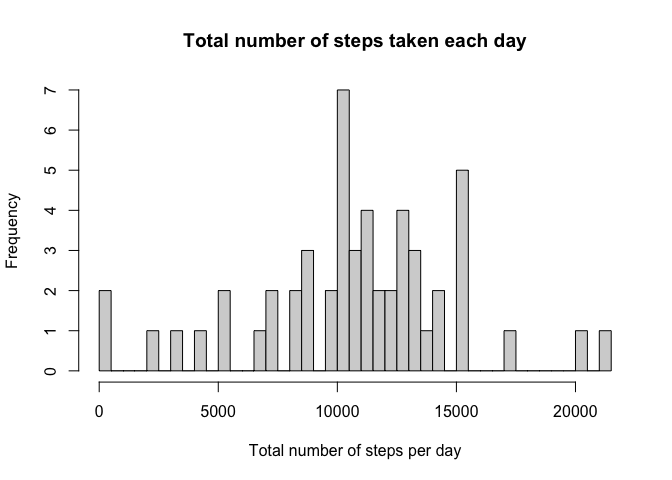
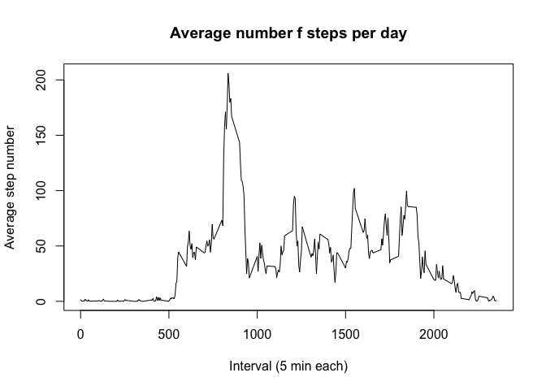

## Summary  
This assignment makes use of data from a personal activity monitoring device. This device collects data at 5 minute intervals throughout the day. The dataset consists of measurements collected from an anonymous during October and November 2012 and include the number of steps taken in 5 minute intervals each day.  

The analysis presented here examines the average

### Data loading and preprocessing  
First, load the libraries used in the analysis.  


```r
library(tidyverse)
```


Check whether data file already exists; otherwise download and unzip. 

First, unzip the data file and save the data into a data frame called 'activity'.  

Convert the 'date' column into Date object format.

```r
 if (!file.exists("activity.zip")) {
  
  fileURL <- "https://d396qusza40orc.cloudfront.net/repdata%2Fdata%2Factivity.zip"
  
  download.file(fileURL, "activity.zip", method = "curl")
  
  # Unzip the file
  unzip("activity.zip", exdir = ".")
 }

# Unzip the file
unzip("activity.zip", exdir = ".")
```

Read in dataset and convert date column to Date format

```r
activity <- read.csv("activity.csv")
activity$date <- as.Date(as.character(activity$date))
```

## Analysis

## What is the mean total number of steps taken per day?

For this part of the assignment, the missing values in the data set were ignored.  

1. Calculate the total number of steps taken per day  

```r
dailySteps <- aggregate(activity$steps, by = list(activity$date), FUN = sum)
names(dailySteps) <- c("date", "sum.of.steps")
head(dailySteps) # check the data
```

```
##         date sum.of.steps
## 1 2012-10-01           NA
## 2 2012-10-02          126
## 3 2012-10-03        11352
## 4 2012-10-04        12116
## 5 2012-10-05        13294
## 6 2012-10-06        15420
```

2. Make a histogram of the total number of steps taken each day  


```r
hist(dailySteps$sum.of.steps, breaks = 61, 
     main = "Total number of steps taken each day", 
     xlab = "Total number of steps per day")
```

<!-- -->
3. Calculate and report the mean and median of the total number of steps taken per day

```r
meanTotalSteps <- as.integer(mean(dailySteps$sum.of.steps, na.rm = TRUE))
medianTotalSteps <- median(dailySteps$sum.of.steps, na.rm = TRUE)
```

The mean total number of steps per day was **10766** steps, and the median number of steps was **10765** steps per day.

## What is the average daily activity pattern?

To examine the average   
1. Make a time series plot (i.e. type = "l") of the 5-minute interval (x-axis) and the average number of steps taken, averaged across all days (y-axis)


```r
dailyAverage <- activity %>% group_by(interval) %>%  summarise(average.steps = mean(steps, na.rm = TRUE))
```

```
## `summarise()` ungrouping output (override with `.groups` argument)
```

```r
plot(x=dailyAverage$interval, y=dailyAverage$average.steps, type = "l", 
     main = "Average number f steps per day", xlab = "Interval (5 min each)", ylab = "Average step number")
```

<!-- -->

2. Which 5-minute interval, on average across all the days in the dataset, contains the maximum number of steps?


```r
dailyAverage[which.max(dailyAverage$average.steps),]
```

```
## # A tibble: 1 x 2
##   interval average.steps
##      <int>         <dbl>
## 1      835          206.
```

## Imputing missing values


```r
missing <- sum(is.na(activity$steps))
```

1. The total number of missing values in the dataset (i.e. the total number of rows with NAs) is **2304**.  

2. Devise a strategy for filling in all of the missing values in the dataset. The strategy does not need to be sophisticated. For example, you could use the mean/median for that day, or the mean for that 5-minute interval, etc.
3. Create a new dataset that is equal to the original dataset but with the missing data filled in.
4. Make a histogram of the total number of steps taken each day and Calculate and report the mean and median total number of steps taken per day. Do these values differ from the estimates from the first part of the assignment? What is the impact of imputing missing data on the estimates of the total daily number of steps?

## Are there differences in activity patterns between weekdays and weekends?
