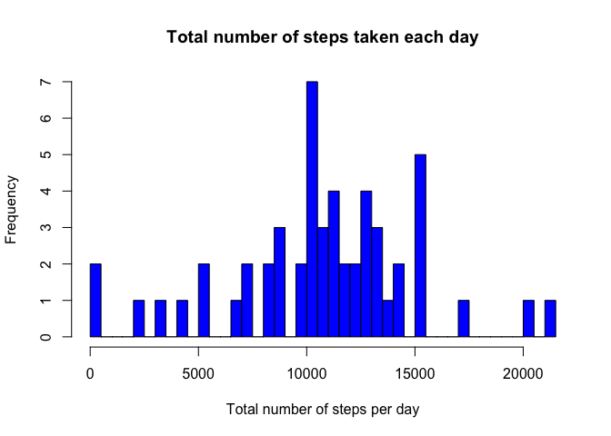
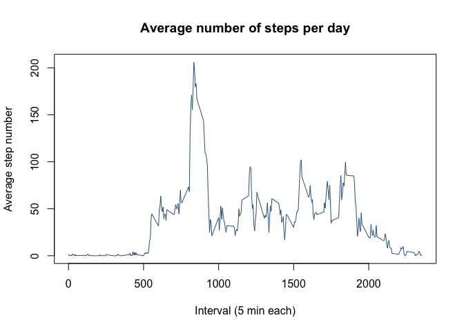

---
title: "Reproducible Research: Peer Assessment 1"
output: 
  html_document: 
    keep_md: true
---


Author: Maurice Farmer  
Date: 24 June 2020


## Summary  
This assignment makes use of data from a personal activity monitoring device. This device collects data at 5 minute intervals throughout the day. The dataset consists of measurements collected from an anonymous during October and November 2012 and include the number of steps taken in 5 minute intervals each day.  

The analysis presented here examines the average

### Data loading and preprocessing  
First, load the libraries used in the analysis.  


```r
library(tidyverse)
library(lattice)
```


Check whether data file already exists; otherwise download and unzip. 

If the data file doesn't exist, download and unzip it. Otherwise, unzip the exisitng file.   


```r
 if (!file.exists("activity.zip")) {
  
  fileURL <- "https://d396qusza40orc.cloudfront.net/repdata%2Fdata%2Factivity.zip"
  
  download.file(fileURL, "activity.zip", method = "curl")
  
  # Unzip the file
  unzip("activity.zip", exdir = ".")
  
 } else {
  # Unzip the file
  unzip("activity.zip", exdir = ".")
 }
```

Read in dataset and convert date column to Date format.  

```r
data <- read.csv("activity.csv")
data$date <- as.Date(as.character(data$date))
```

## Analysis

## What is the mean total number of steps taken per day?

For this part of the assignment, the missing values in the data set were ignored.  

1. Calculate the total number of steps taken per day  

```r
dailySteps <- aggregate(data$steps, by = list(data$date), FUN = sum)
names(dailySteps) <- c("date", "sum.of.steps")
head(dailySteps) # check the data
```

```
##         date sum.of.steps
## 1 2012-10-01           NA
## 2 2012-10-02          126
## 3 2012-10-03        11352
## 4 2012-10-04        12116
## 5 2012-10-05        13294
## 6 2012-10-06        15420
```

2. Make a histogram of the total number of steps taken each day  


```r
hist(dailySteps$sum.of.steps, breaks = 61, 
     main = "Total number of steps taken each day", 
     xlab = "Total number of steps per day",
     col = "blue")
```

<!-- -->

3. Calculate and report the mean and median of the total number of steps taken per day

```r
meanTotalSteps <- as.integer(mean(dailySteps$sum.of.steps, na.rm = TRUE))
medianTotalSteps <- median(dailySteps$sum.of.steps, na.rm = TRUE)
```

The mean total number of steps per day was **10766** steps.   
The median number of steps was **10765** steps per day.

## What is the average daily activity pattern?

1. Make a time series plot (i.e. type = "l") of the 5-minute interval (x-axis) and the average number of steps taken, averaged across all days (y-axis)


```r
dailyAverage <- data %>% group_by(interval) %>%  summarise(average.steps = mean(steps, na.rm = TRUE))

plot(x=dailyAverage$interval, y=dailyAverage$average.steps, type = "l", 
     main = "Average number of steps per day", 
     xlab = "Interval (5 min each)", 
     ylab = "Average step number",
    col = "steelblue4"  )
```

<!-- -->

2. Which 5-minute interval, on average across all the days in the dataset, contains the maximum number of steps?


```r
avInterval <- dailyAverage[which.max(dailyAverage$average.steps),]
```

The interval with the highest average steps is interval **835** which has an average of **206** steps.

## Imputing missing values

A simple strategy to for filling in all of the missing values in the dataset is to use the average for that 5-minute interval. This was computed as follows and stored as a seperate data frame ('imputedData') and a histogram of the resulting dataset is shown below.

1. The total number of missing values in the dataset (i.e. the total number of rows with NAs) is 

```r
sum(is.na(data$steps))
```

```
## [1] 2304
```

Imputing the missing values used the average for that 5-min interval was done as follows:  


```r
imputedData <- data

for (i in 1:nrow(imputedData)) {
    if(is.na(imputedData$steps[i])) {
      imputedData$steps[i] <- mean(imputedData$steps[imputedData$interval==imputedData$interval[i]], 
                                   na.rm = TRUE)}}

imputedAverage <- imputedData %>% group_by(interval) %>%  summarise(average.steps = mean(steps, 
                                                                                         na.rm = TRUE))

hist(imputedAverage$average.steps, breaks = 61, 
     main = "Total number of steps taken each day \n(imputing using mean)", 
     xlab = "Total number of steps per day",
     col = "blue")
```

<!-- -->

The table below shows the mean and median calculated values for the data when it contains missing values and when it contains imputed values.    


```r
dMeanTotalSteps <- as.integer(mean(imputedAverage$average.steps, na.rm = TRUE))
dMedianTotalSteps <- median(imputedAverage$average.steps, na.rm = TRUE)
```


| Statistic | With Missing Values | With Imputed Values |
|-----------|---------------------|---------------------|
| Mean      | 10766 |   37|
| Median    | 10765| 34 |

From these data it can be seen that imputing hte missing values using the mean for the respective 5-min interval has decreased the average number of steps taken each day by nearly 300-fold, even though there were only 8 days of data missing in the data set.   

## Are there differences in activity patterns between weekdays and weekends?

For this part of the analysis the dataset with the filled-in missing values was used.

1. Create a new factor variable in the dataset with two levels – “weekday” and “weekend” indicating whether a given date is a weekday or weekend day.


```r
imputedData$weekday <- weekdays(imputedData$date)

imputedData <- mutate(imputedData, dayType = factor(case_when(weekday %in% c("Monday", "Tuesday", "Wednesday", "Thursday", "Friday") ~ "weekday", weekday %in% c("Saturday", "Sunday") ~ "weekend", TRUE ~ NA_character_)))
```
Make a panel plot containing a time series plot (i.e. type = "l") of the 5-minute interval (x-axis) and the average number of steps taken, averaged across all weekday days or weekend days (y-axis). See the README file in the GitHub repository to see an example of what this plot should look like using simulated data.

```r
d <- aggregate(steps~interval + dayType, data=imputedData, mean)

xyplot(steps ~ interval | dayType, data=d, type = "l", layout = c(1,2), xlab="Interval", ylab="Number of steps")
```

<!-- -->
